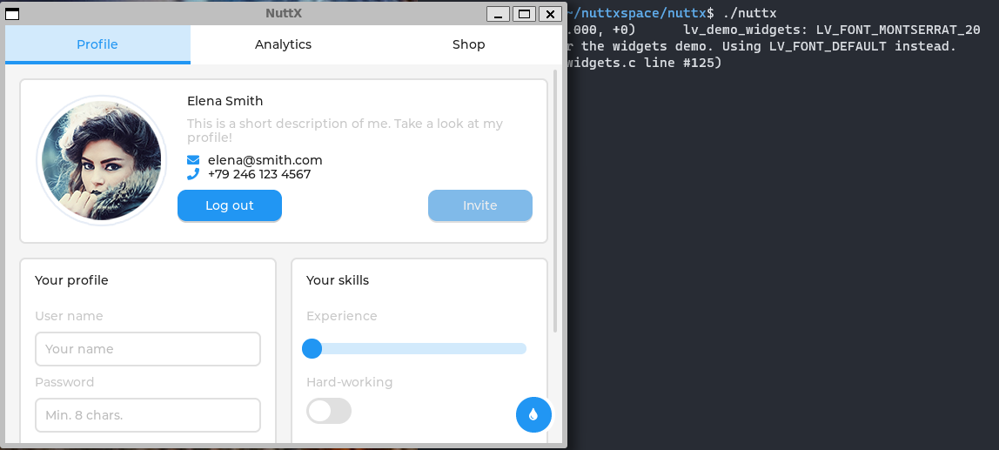

# Getting Started with Apache NuttX on Linux/WSL2 (Windows)

## What is APACHE NUTTX?
Apache NuttX is a real-time operating system (RTOS) with an emphasis on standards compliance and small footprint. Scalable from 8-bit to 64-bit microcontroller environments, the primary governing standards in NuttX are POSIX and ANSI standards. 

## Get started with Apache NuttX on Ubuntu/WSL2 (Windows)
- Install & Setup tools required to run Apache NuttX
- Compile and run NuttX shell called `nsh`
- Compile and run LVGL GUI Demo on NuttX (Windows 11 required which supports graphics WSLg)

## Installing pre-requisites
```bash
# Install g++ / cmake / gdb (cmake support coming soon)
$ sudo apt update 
$ sudo apt install build-essential gdb  
$ sudo apt install cmake

# Install other pre-requisites
$ sudo apt install \
bison flex gettext texinfo libncurses5-dev libncursesw5-dev xxd \
gperf automake libtool pkg-config build-essential gperf genromfs \
libgmp-dev libmpc-dev libmpfr-dev libisl-dev binutils-dev libelf-dev \
libexpat-dev gcc-multilib g++-multilib picocom u-boot-tools util-linux
```

## Ubuntu/WSL2 config and python dependency
```bash
# WSL2 on Windows 11 supports WSLg for running graphical applications
$ sudo apt install kconfig-frontends
$ pip install kconfiglib
$ pip install pyelftools cxxfilt
```

## Toolchain - Ubuntu/WSL2
```bash
$ sudo apt install gcc-arm-none-eabi binutils-arm-none-eabi
```

## Install filesystem creation utility
```bash
# Install genromfs
$ sudo apt-get install genromfs

# Add at the end of `~/.bashrc` for environment path settings to be permanent
export PATH=$PATH:/usr/bin/genromfs

# Test to verify its available in the path
$ genromfs -v
```

## Clone Apache NuttX from Github repo
```bash
# Create a workspace folder and switch to it
$ mkdir nuttxspace && cd nuttxspace

# Clone Apache NuttX repo
$ git clone https://github.com/apache/nuttx.git nuttx

# Clone Apache NuttX Application repo
$ git clone https://github.com/apache/nuttx-apps apps
```

## Setup and build NuttX and its shell (inside 'nuttxspace/nuttx' folder)
```bash
# Clean the previous build files (if any)
$make distclean

# Setup to use NuttX simulator with shell called nsh
$ ./tools/configure.sh sim:nsh
$ make
```

## Run the shell 
```bash
# Default user name is admin and password is Administrator
$ ./nuttx
NuttShell (NSH) NuttX-12.0.0
MOTD: username=admin password=Administrator

# Checking NuttX version info
nsh> uname -a
NuttX  12.0.0 4f3c73fb45 Feb 25 2023 16:55:37 sim sim

# To see installed tools and get help use `?` from the shell
# Your output might be different since I have few more apps enabled. You can do so, using `make menuconfig`
nsh> ?
help usage:  help [-v] [<cmd>]

  .         cd        echo      hexdump   ls        poweroff  set       uname
  [         cp        env       ifconfig  mkdir     printf    sleep     umount
  ?         cmp       exec      ifdown    mkfatfs   ps        source    unset
  arp       dirname   exit      ifup      mkrd      pwd       test      uptime
  basename  dd        false     kill      mount     readlink  time      usleep
  break     df        free      losetup   mv        rm        true      xd
  cat       dmesg     help      ln        nslookup  rmdir     truncate

Builtin Apps:
  dumpstack   gps         nsh         ubloxmodem
  gpio        hello       sh

# Run hello world included
nsh> hello
Hello, World!!

# You can exit from the shell using the following command
nsh> poweroff
```

## Running LVGL Demo Ubuntu Desktop / WSL2 (Windows 11)
_WSL2 requires Windows 11 which supports graphics using WSLg_  
```bash
# Clean the previous build files
$ make distclean

# Setup to use NuttX simulator with LVGL using Framebuffer
$ ./tools/configure.sh sim:lvgl_fb

# Time to cook it ;)
$ make -j

# Run the binary and you should see a LVGL default demo window
$ ./nuttx
```

  

## Where to find more info
- Get Apache NuttX from the repo [here](https://github.com/apache/nuttx)
- Documentation of Apache NuttX is [here](https://nuttx.apache.org/docs/latest/index.html)
